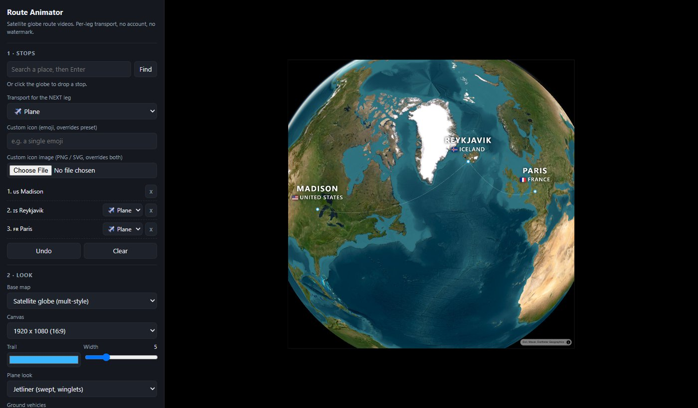
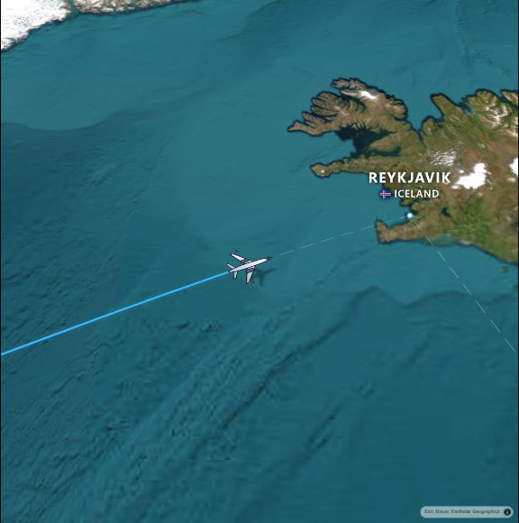
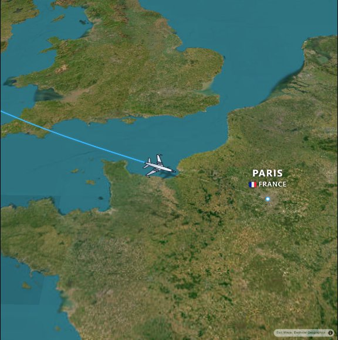

# Route Animator

A free, single-file replacement for paid map-route video makers (mult.dev and similar).
Animates a vehicle along a multi-stop route over a photorealistic satellite globe and
records the result to video. No account, no API key, no watermark, no export limit.

**Live: <https://webgrs.github.io/route-animator/>**



<p>
  
  
</p>

*Frames from the preview. `python docs/screenshots.py` rebuilds these images.*

## Run

```sh
git clone https://github.com/WEBGRS/route-animator.git
cd route-animator
python -m http.server 8791
```

Open <http://localhost:8791/index.html> in **Chrome**. Recording uses `MediaRecorder` +
`canvas.captureStream`, which needs a Chromium-based browser.

Serve over `http://` rather than opening the file directly — some browsers block `fetch`
from `file://` origins, which breaks search, road routing, and the emoji icons.

## The look

- **Globe projection** (MapLibre GL JS 5) on a black space background
- **Esri World Imagery** satellite tiles
- **Atmospheric limb glow** via `setSky`, faded out as the camera descends
- Bold uppercase city labels with country flag, drawn to canvas so recording captures them. **Label language** defaults to English, because Nominatim otherwise answers in the browser's language and the uppercase letter-spaced type is designed for Latin script
- Thin glowing trail behind the vehicle, faint dashed line ahead

### Vehicle artwork

Emoji are a three-quarter side view, which reads wrong from directly overhead, so every
vehicle is drawn top-down with canvas paths instead. All of it points north, so it takes
the heading rotation directly with no per-glyph offset fudge.

- **Plane look** picks between a swept jetliner with winglets, a sharp delta jet, a
  minimal folded paper plane, and a wide-body.
- **Ground vehicles** switches between the artwork set (car, bus, high-speed train, ship)
  and plain emoji.
- Bike and walk legs get the GPS-puck idiom — a heading cone over a ringed dot — because a
  top-down cyclist or pedestrian is unreadable at icon size.
- Any leg can take a **custom icon image** (PNG or SVG upload), which overrides everything
  and gets its own generated shadow.

### Climb, cruise, descend

With **Climb / cruise / descend altitude** on, a flying leg gets an altitude profile that
several things read from at once:

- the aircraft icon grows by 55% as it climbs and shrinks back on approach
- a blurred black silhouette of the same icon sits underneath as a ground shadow, sliding
  further from the aircraft and darkening the higher it goes — this is what actually
  sells altitude on a flat map
- the camera hugs the departure airport, pulls back 3.2 zoom levels for the cruise, then
  drops back in for the arrival; pitch follows zoom, so both ends get an oblique
  near-runway view and the cruise is flat and top-down
- every leg eases in and out on its own, so the vehicle accelerates away from each stop
  and slows into the next, instead of one flat glide across the whole route

Altitude is keyed to leg-local **time**, not distance travelled. Keying it to distance
made the climb swallow a third of the flight, because the easing compresses distance at
the ends and the aircraft just sat there slowly inflating.

### Pacing

The clip is a list of segments: a **hold** on each city, and a leg between them. Without
the holds the vehicle only grazed each stop and the label was gone before you could read
it. **Hold on each city** sets how long each pause runs (1.5 s by default), and the camera
pushes in gently and settles back while it sits there. Holds are capped at 70% of the
total so they can never eat the whole clip.

**Screen time per leg** decides how the rest of the duration is divided up:

- *Equal* gives every leg the same share whatever its length. A 12,675 km flight and a
  130 km train ride each get half the clip.
- *Balanced* weights by length to the power 0.3, so long legs run a little longer without
  taking over.
- *By distance* is the realistic split, and is lopsided on purpose: on that same route the
  train gets 1% of the clip.

Distance share and time share are separate. Sharing time by distance was why shortening
the duration used to squeeze every leg equally and never made the short hop visible.

## Use

1. **Stops** — type a place name and press Enter, or click the globe. Clicked stops are
   reverse-geocoded for their city and country.
2. **Transport per leg** — pick the mode *before* adding a stop, or change it later in the
   stop list. Every leg can differ: fly, then train, then drive. Road modes snap to real
   roads; plane/train/ship draw a curved great-circle arc. The "Custom icon" box takes any
   emoji and overrides the preset.
3. **Look** — base map, canvas size (16:9, 9:16 vertical for short-form video, square),
   trail colour and width, plane look, ground-vehicle set, icon and label size, globe
   on/off, atmosphere, 3D terrain.
4. **Camera** —
   - *Auto cinematic* sizes the zoom per leg from its length, so a long flight pulls back
     to the globe and a short train hop drops in close, easing between legs. Pitch tilts
     in only once the camera is below globe altitude.
   - *Fixed zoom* chases at one zoom level.
   - *Static overview* holds the whole route in frame.

   **Screen time per leg** splits the duration between legs — equal by default, so a long
   flight does not swallow the clip.
5. **Render scale** is the multiplier on canvas pixels. 1x renders exactly the chosen
   canvas size and is the fastest; 2x is sharper and roughly four times the fill cost.
6. **Preview** to check — a live fps counter sits in the top-right — then **Record**.
   Chrome records H.264 MP4 directly, so no conversion step is needed.

## How it stays smooth

The naive version of this — rebuilding a growing GeoJSON line and calling `setData` every
frame — is what makes most browser map animations stutter, because every update is
serialised to a worker, re-tiled, re-tessellated and re-uploaded. This avoids that:

- The full route is uploaded **once** with `lineMetrics: true`. The trail is revealed by
  setting a `line-gradient` keyed on `line-progress`, which is one cheap paint property
  per frame instead of a whole geometry round-trip.
- Positions come from a precomputed cumulative-length array via binary search and a lerp,
  rather than walking the polyline with `turf.along` / `turf.lineSliceAlong` every frame.
- Progress is parameterised in **mercator** length, the same measure `line-progress` uses,
  so the trail head stays exactly under the vehicle.
- `fadeDuration: 0` and a large tile cache stop symbol cross-fades and tile re-fetches
  from fighting the continuously changing auto-camera zoom.
- `pixelRatio` is pinned to 1 by default instead of following a HiDPI display.
- Recording prefers H.264, which Chrome encodes in hardware; VP9 is a software encoder
  and drops frames at 1080p.

### Where the time actually goes

Profiling the frame loop settled it: per frame the script costs about **2.7 ms** — 0.2 ms
in `setData`, 0.5 ms in `setPaintProperty`, 2.0 ms in `jumpTo` — while whole frames were
taking 120 ms. The stutter was never script-bound, so micro-optimising it further was
pointless. It is tile fetch, decode and upload, because the camera races across the globe
faster than Esri tiles arrive.

Hence **Preload tiles**: it flies the camera along the route in 84 steps first, waiting
for each viewport to settle, which pulls everything the clip needs into the tile cache.
Measured on a Chicago–Hong Kong–Guangzhou route, the share of playback frames still
waiting on tiles dropped from **86% to 56%**. Recording runs it automatically unless you
untick **Cache tiles before recording**.

The fps overlay reads `30 fps · js 2.4ms · tiles`. If the script figure is small and
`tiles` is showing, you are tile-bound and preloading is the answer. If the script figure
is large, something else is wrong.

### Camera rate limiting

Leaving a city close-up for cruise altitude is a seven zoom-level move, and the descent
profile and the close-up blend compound: the raw camera target peaked above **8 zoom
levels per second**, which reads as a lurch rather than a glide. A plain low-pass filter
did not fix it — it damps steps, not a target sliding that fast for two seconds. The frame
loop now clamps the zoom rate to 3 levels per second and then smooths the corners the
clamp leaves. Measured peak camera rate: **3.0 levels/s**, converging to within 0.08 of
the target by the end. Position is never smoothed, it has to stay under the vehicle.

If it still stutters: preload first, drop to 30 fps, keep render scale at 1x, use the
1280x720 canvas, and leave 3D terrain off — terrain re-meshes the surface on every camera
move and is by far the most expensive option here.

## Services used (all free, no key)

| Purpose | Service |
|---|---|
| Satellite tiles | Esri World Imagery |
| Vector tiles | OpenFreeMap (Dark / Liberty) |
| Elevation | AWS Terrain Tiles (terrarium) |
| Road routing | OSRM demo server |
| Place search | Nominatim (OpenStreetMap) |
| Emoji + flags | Twemoji SVG via jsDelivr |
| Map rendering | MapLibre GL JS 5 |
| Geometry | Turf.js (distance/bearing only) |

Nominatim and the OSRM demo server are rate-limited community endpoints. They are fine
for personal use; do not hammer them.

## Known limits

- The OSRM demo server only runs the `driving` profile, so bike and walk legs follow
  driving geometry.
- Emoji come from Twemoji rather than the system font, because Segoe UI Emoji has no flag
  glyphs — Windows renders every flag as two letters. If jsDelivr is unreachable the code
  falls back to the system font and flags degrade to letters again.
- Labels use collision detection, so two stops close together at low zoom show only one.
- Nominatim sometimes returns several names joined by ';' for one field ("United States" can arrive as a simplified/traditional Chinese pair). Only the first is kept.
- Flight arcs bow out from the great circle by at most 700 km, so the curve stays
  decorative rather than turning a transpacific route into a detour.
- Recording is realtime. If the preview cannot hold the target fps, the recording won't
  either.
- Routing and geocoding requests abort after 8 seconds. The OSRM demo server can hang
  indefinitely on an unroutable pair (a sea crossing asked for by car, for instance);
  without the deadline that wedges the whole route build.
